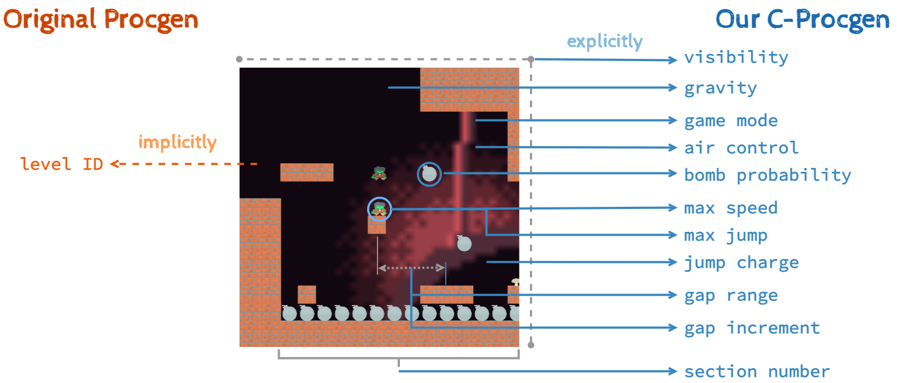

**Status:** Maintenance (expect bug fixes and minor updates)

# C-Procgen Benchmark



C-Procgen is an enhanced benchmark based on [Procgen](https://github.com/openai/procgen).
It provides precise control over context generation, allowing researchers to customize context parameters according to their specific requirements. 
With added engineering enhancements such as flexible context assignment, dynamic modification, and detailed context tracking, C-Procgen offers improved usability. 
This makes it an excellent platform for studying curriculum reinforcement learning and analyzing learning dynamics in various Procgen contexts.

## Installation

C-Procgen can be installed following the same steps as the original Procgen's "Install from source" method. Please ensure that the dependencies listed in the [`environment.yml`](environment.yml) file are met, and then install C-Procgen.
1. Update the conda environment:
```
conda env update --file environment.yml
```
2. Once the dependencies are installed, proceed to install C-Procgen:
```
pip install -e .
# this should say "building procgen...done"
```

The environment code is in C++ and is compiled into a shared library exposing the [`gym3.libenv`](https://github.com/openai/gym3/blob/master/gym3/libenv.h) C interface that is then loaded by python.  The C++ code uses [Qt](https://www.qt.io/) for drawing.

## Quick Start

```
# Import the 
from procgen import ProcgenEnv

# Define the context parameters for different contexts
context_1 = {
    "air_control": 0.2,
    "visibility": 10,
}

context_2 = {
    "air_control": 0.2,
    "visibility": 6,
}

context_3 = {
    "bomb_prob": 0.3,
    "jump_charge_inc": 0.25,
}

# Create a Procgen environment with 3 instances and the 'ninja' game, specifying the context options
env = ProcgenEnv(num_envs=3, env_name='ninja', context_options=[context_1, context_2, context_3])

```


## Environment Options

* `env_name` - Name of environment, or comma-separate list of environment names to instantiate as each env in the VecEnv.
* `use_backgrounds=True` - Normally games use human designed backgrounds, if this flag is set to `False`, games will use pure black backgrounds.
* `restrict_themes=False` - Some games select assets from multiple themes, if this flag is set to `True`, those games will only use a single theme.
* `use_monochrome_assets=False` - If set to `True`, games will use monochromatic rectangles instead of human designed assets. best used with `restrict_themes=True`.

Here's how to set the options:

```
import gym
env = gym.make("procgen:procgen-coinrun-v0", start_level=0, num_levels=1)
```

Since the gym environment is adapted from a gym3 environment, early calls to `reset()` are disallowed and the `render()` method does not do anything.  To render the environment, pass `render_mode="human"` to the constructor, which will send `render_mode="rgb_array"` to the environment constructor and wrap it in a `gym3.ViewerWrapper`.  If you just want the frames instead of the window, pass `render_mode="rgb_array"`.

For the gym3 vectorized environment:

```
from procgen import ProcgenGym3Env
env = ProcgenGym3Env(num=1, env_name="coinrun", start_level=0, num_levels=1)
```

To render with the gym3 environment, pass `render_mode="rgb_array"`.  If you wish to view the output, use a `gym3.ViewerWrapper`.
